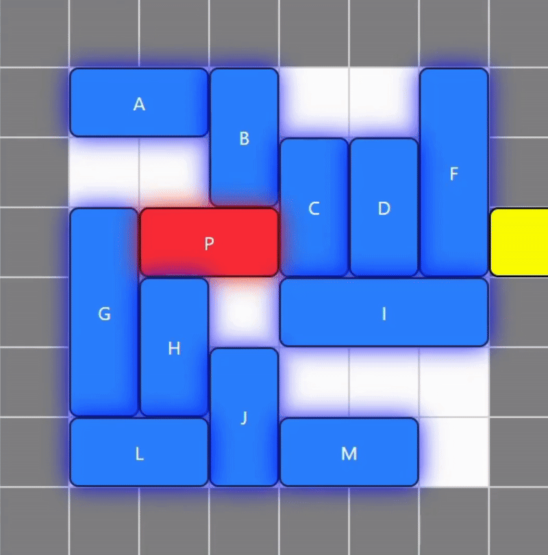

# Penyelesaian Puzzle Rush Hour

<div align="center">
  <h3>Penyelesai Puzzle menggunakan Algoritma Pencarian</h3>
  <p>Tugas Kecil 3 IF2211 Strategi Algoritma</p>
</div>

## Deploy

Aplikasi dapat dicoba secara online melalui link berikut:  
[https://.vercel.app/](https://.vercel.app/)

## Gambaran Umum

Penyelesaian Puzzle Rush Hour adalah aplikasi web yang menyelesaikan permainan puzzle Rush Hour klasik menggunakan berbagai algoritma pencarian. Puzzle terdiri dari grid dengan kendaraan berbagai ukuran. Tujuannya adalah memindahkan mobil merah (kendaraan target) ke pintu keluar dengan menggeser kendaraan lain agar tidak menghalangi jalan.

Aplikasi ini dikembangkan sebagai bagian dari tugas kecil mata kuliah Strategi Algoritma di Institut Teknologi Bandung.

## Fitur-Fitur

- Visualisasi puzzle interaktif
- Implementasi beberapa algoritma pencarian:
  - Greedy Best-First Search
  - A\* Search
  - Uniform Cost Search (UCS)
  - Fringe Search
- Berbagai fungsi heuristik
  - Distance
  - Blocking Vehicles
  - Combined
  - Recursive
  - Move estimation
- Pemutaran solusi langkah demi langkah
- Statistik kinerja (waktu eksekusi, jumlah simpul yang dikunjungi)
- Unggah file untuk puzzle kustom
- Ekspor solusi ke file teks

## Algoritma

1. **Greedy Best-First Search**

   - Algoritma pencarian heuristik yang memprioritaskan node berdasarkan nilai heuristik
   - Selalu memilih node dengan nilai heuristik terkecil untuk dieksplorasi selanjutnya
   - Tidak mempertimbangkan biaya perjalanan (g)
   - Cepat tetapi tidak menjamin solusi optimal

2. **A\* Search**

   - Algoritma pencarian heuristik yang menggabungkan informasi biaya dan estimasi jarak
   - Menggunakan fungsi f(n) = g(n) + h(n)
   - g(n) adalah biaya dari keadaan awal ke node saat ini
   - h(n) adalah estimasi heuristik dari node saat ini ke tujuan
   - Menjamin solusi optimal jika heuristik admissible (tidak overestimasi)

3. **Uniform Cost Search (UCS)**

   - Algoritma pencarian blind yang menjamin solusi optimal dengan biaya terendah
   - Menggunakan prioritas berdasarkan biaya kumulatif g(n)
   - Tidak menggunakan fungsi heuristik
   - Kurang efisien untuk ruang pencarian besar

4. **Fringe Search**
   - Algoritma hybrid yang menggabungkan aspek dari A\* dan depth-first search
   - Menggunakan strategi batas (limit) dan iterasi yang lebih hemat memori
   - Lebih efisien dalam penggunaan memori dibanding A\* standar
   - Menjelajahi ruang pencarian dalam level f-cost yang meningkat

## Fungsi Heuristik

1. **Distance**

   - Menghitung jarak Manhattan dari mobil target ke pintu keluar
   - Semakin dekat ke pintu keluar, semakin rendah nilai heuristik
   - Sederhana dan cepat untuk dihitung

2. **Blocking Vehicles**

   - Menghitung jumlah kendaraan yang menghalangi jalur langsung ke pintu keluar
   - Semakin sedikit kendaraan yang menghalangi, semakin rendah nilai heuristik
   - Memberikan gambaran kompleksitas situasi

3. **Combined**

   - Menggabungkan informasi dari heuristik jarak dan blocking vehicles
   - Memberikan pandangan lebih seimbang tentang keadaan puzzle
   - Umumnya lebih efektif daripada menggunakan satu jenis heuristik saja

4. **Recursive**

   - Mempertimbangkan penghalang secara rekursif, termasuk kendaraan yang menghalangi penghalang utama
   - Mengevaluasi kompleksitas pembebasan jalur secara mendalam
   - Lebih akurat tetapi membutuhkan komputasi lebih banyak

5. **Move estimation**
   - Memperkirakan jumlah langkah minimum yang dibutuhkan untuk mencapai tujuan
   - Mempertimbangkan posisi relatif semua kendaraan dan pola gerakan yang mungkin
   - Heuristik paling kompleks tetapi potensial lebih akurat

## Persyaratan

- Node.js (>= v22.0.0)
- npm atau yarn
- Browser web modern (Chrome, Firefox, Safari, Edge)

## Instalasi & Menjalankan Aplikasi

### Mode Pengembangan

````bash
# Mengkloning repositori
git clone https://github.com/d2v6/Tucil3_13523003_13523099.git

# Pindah ke direktori sumber
cd src

# Instalasi dependensi
npm install

# Menjalankan server pengembangan
npm run dev

### Mode Production

```bash
# Pindah ke direktori bin
cd bin

# Menyajikan file statis (menggunakan server HTTP sederhana)
npx serve -s

# Alternatif, jika serve diinstal secara global
serve -s
````

## Panduan Penggunaan

### Mengunggah file puzzle

1. Klik tombol "Upload"
2. Pilih file konfigurasi puzzle yang valid
3. Puzzle akan ditampilkan di papan

### Membuat papan secara manual

1. Atur ukuran papan dengan menggunakan input "Board Width" dan "Board Height"
2. Pilih posisi pintu keluar dengan mengklik sel di tepi papan
3. Tambahkan kendaraan:
   - Pilih ukuran kendaraan
   - Pilih orientasi (horizontal/vertikal)
   - Centang "Primary" untuk mobil target (merah)
   - Klik "Add Car"
4. Atur posisi kendaraan dengan menyeretnya ke posisi yang diinginkan
5. Hapus kendaraan dengan menyeretnya ke luar papan

### Memilih algoritma dan heuristik

1. Pilih algoritma pencarian dari dropdown "Algorithm"
2. Jika menggunakan algoritma heuristik (GBFS atau A\*), pilih fungsi heuristik dari dropdown "Heuristic"
3. Pilihan algoritma:
   - UCS (Uniform Cost Search)
   - GBFS (Greedy Best-First Search)
   - A\* (A Star)
   - Fringe Search
4. Pilihan heuristik:
   - Distance
   - Blocking Vehicles
   - Combined
   - Recursive
   - Move Estimation

### Menyelesaikan puzzle

1. Pastikan ada satu mobil primer (merah) dan pintu keluar telah ditetapkan
2. Klik tombol "Solve" untuk mencari solusi
3. Sistem akan menampilkan:
   - Jumlah langkah solusi
   - Waktu eksekusi algoritma
   - Jumlah node yang dieksplorasi

### Melihat dan mengontrol solusi

1. Setelah solusi ditemukan, bagian kontrol solusi akan muncul
2. Gunakan tombol panah untuk navigasi langkah demi langkah:
   - ← untuk mundur satu langkah
   - → untuk maju satu langkah
3. Klik "Auto Play" untuk menjalankan animasi solusi secara otomatis
4. Klik "Stop" untuk menghentikan pemutaran otomatis
5. Klik "Reset Board" untuk mengembalikan papan ke keadaan awal
6. Klik "Download Solution" untuk mengunduh solusi dalam format teks

## Anggota Tim

| Nama               | NIM      |
| ------------------ | -------- |
| Dave Daniell Yanni | 13523003 |
| Daniel Pedrosa Wu  | 13523099 |
